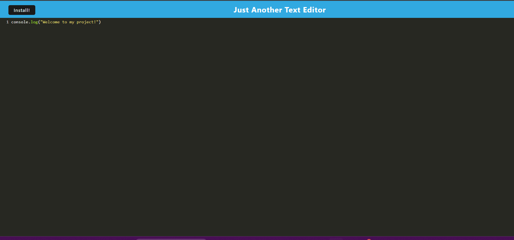

# Text Editor 

## Description
Do you need a place to write your notes, well here it is! Text Editor is a website where you can write your notes and save them for later. Use in browser or install on your desktop.

## Technologies Used
HTML5, CSS3, JavaScript (ES6+), Node.js, Express.js, Webpack, IndexedDB 

## Installation
1. Clone the repository: git clone https://github.com/yourusername/text-editor.git
2. cd into the project
3. run npm install
4. run npm run build
5. run npm run start

## Usage
1. Open your terminal
3. run npm install
4. run npm run build
5. run npm run start
6. Open in browser at localhost:3000

## Contributing
If you would like to contribute to this project, please fork the repository and submit a pull request with any changes.

## License
This project is not licensed.

## Links
Github: https://github.com/Betzaida96/text-editor

Render: https://text-editor-j2q7.onrender.com

## Photos

